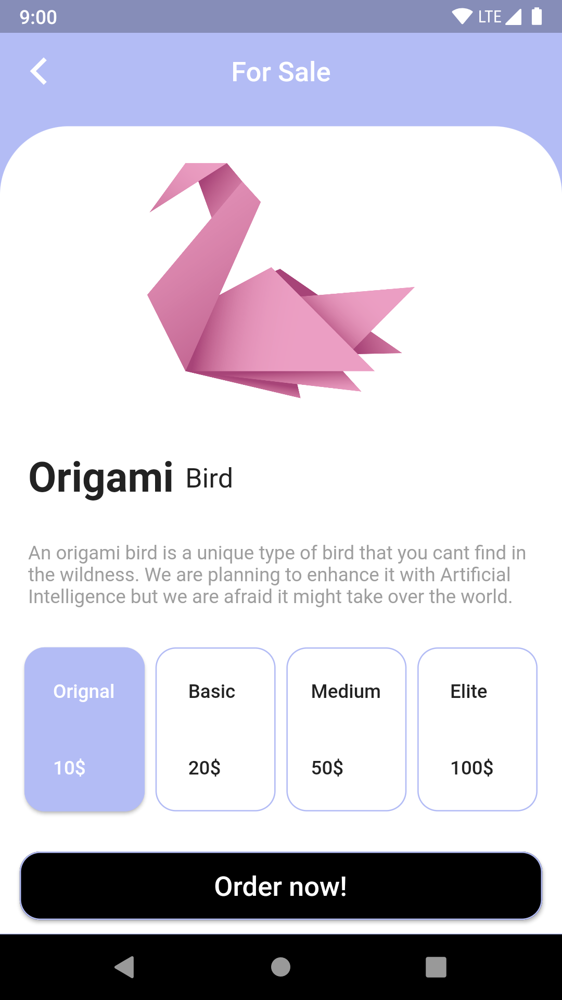

# Flutter Origami Details

This source code is to be used as for refrence in "Building Flutter UI’s with 10 widgets only!" workshop in Bahrian. The purpose is to how you can create a beatuful Flutter UI using 10 widgets only. It is for beginners and I hope it will inspire you to do more.. 

# Demo 

# Getting Started
1. [Fork repository](https://github.com/sayed3li97/FlutterClock-Challenge-BH/fork) or clone and download the repository 
1. Install [Latest Flutter version](https://flutter.dev/docs/get-started/install)
1. Install [Android Studio / IntelliJ / VSCode](https://flutter.dev/docs/development/tools/android-studio)
1. Run the command `flutter pub get`
1. Run the command `flutter run`

1. If you don't have flutter installed you can use [DartPad](https://dartpad.dartlang.org/) However, you will not be able to use external packages  

